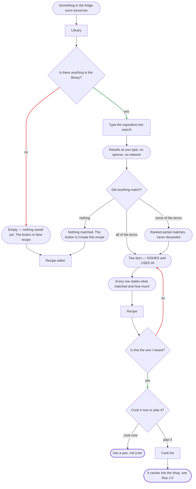
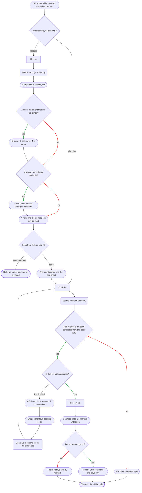

# User flows

**Date:** 5 August 2026 · draft
**Built on:** the nine screens in [`sitemap.md`](./sitemap.md) and the jobs in [`research/jtbd.md`](./research/jtbd.md).

**Every screen node in these diagrams exists in the sitemap.** Where a flow needed something the sitemap did not have, the sitemap was updated and the job recorded — it happened once, for **Replace ingredient**.

### How to read the shapes

| Shape | Means |
|---|---|
| `["Library"]` **rectangle** | A screen. The name matches [`sitemap.md`](./sitemap.md) exactly |
| `{"Question?"}` **rhombus** | A decision — the person's or the app's |
| `(["Loading …"])` **stadium** | A state: empty · loading · offline · changed. **Not** a screen |
| `("Name it")` **round** | A control, a sheet or an action. Not a screen either |
| **dashed outline** | A dead end — somewhere a person can get stuck, or an outcome the product cannot prevent. **After the 5 August audit there are two left in the whole product**, and both are decisions rather than oversights |
| **green arrow** | A branch labelled **yes** |
| **red arrow** | A branch labelled **no** |

**Green does not mean good.** The colour marks which answer was given, not whether the outcome is desirable — *"any flagged rows? — yes"* is green and is bad news. Branches with any other label stay neutral, because *"add to it"* and *"start a new one"* are two right answers, not a right and a wrong one.

**On loading states.** Cooksy reads from the device, so most of it has none. Two are honest: the first sync onto a new device, and **the model formatting a pasted recipe** — which as of 5 August is a network round trip and no longer a local moment. Where a flow has none, it says so.

---

## J-0 · The main job — getting everything into the house in one go

> **When** I have decided what we are eating over the next few days, **I want** to get everything into the house in one go, without doing the arithmetic or the remembering myself, **so that** the week I planned is the week we actually cook.

```mermaid
flowchart TD
    begin(["I have decided what we are eating"]) --> lib["Library"]
    lib --> qSync{"Is my library on this device?"}

    qSync -->|"first run"| load(["Loading — pulling the library down"])
    load --> qNet{"Any signal?"}
    qNet -->|no| nolib(["Nothing to plan with yet — but the editor still works offline"])
    nolib --> editor
    qNet -->|yes| lib

    qSync -->|yes| qEmpty{"Is there anything saved?"}
    qEmpty -->|no| empty1(["Empty — no recipes yet"])
    empty1 --> editor["Recipe editor"]
    qEmpty -->|yes| qHave{"Is the dish I want already saved?"}
    qHave -->|no| editor
    editor -->|"see flow J-1"| qHave
    qHave -->|yes| rec["Recipe"]

    rec --> qSwap{"Swap an ingredient?"}
    qSwap -->|yes| swap["Replace ingredient"]
    qSwap -->|no| setp("Set the number of portions")
    swap --> qScope{"Once, always, or as a copy?"}
    qScope -->|"just this time"| once(["Carried on the cook list entry only"])
    qScope -->|"always"| forever(["The recipe itself is edited"])
    qScope -->|"as a copy"| variant(["A second recipe — the diet version"])
    once --> setp
    forever --> setp
    variant --> setp

    setp --> addsheet("Add to cook list")
    addsheet --> qMore{"Another dish this week?"}
    qMore -->|yes| qHave
    qMore -->|no| cook["Cook list"]

    cook --> gen("Generate grocery list")
    gen --> qOpen{"Is a list already in progress?"}
    qOpen -->|yes| qChoice{"Add to it or start a new one?"}
    qChoice -->|"add to it"| remerge(["Re-merged across both, quantities stay correct"])
    qChoice -->|"start a new one"| kept(["The old one is kept, never destroyed"])
    qOpen -->|no| glist["Grocery list"]
    remerge --> glist
    kept --> glist

    glist --> qDraft{"Is any entry a draft with no rows?"}
    qDraft -->|yes| holder(["Placeholder line — it cannot be ticked, and it says why"])
    holder --> qFix2{"Format it now?"}
    qFix2 -->|yes| editor
    qFix2 -->|no| byhand("Add what it needs by hand")
    byhand --> qFlag
    qDraft -->|no| qFlag{"Did a line land in OTHER with a flag?"}

    qFlag -->|yes| fix["Fix ingredient"]
    fix --> glist
    qFlag -->|"not now"| asis(["Buy it anyway, the text is still on the line"])
    qFlag -->|no| qShop{"Signal in the shop?"}
    asis --> qShop

    qShop -->|no| offline(["Offline — the list reads locally, ticks queue"])
    qShop -->|yes| tick("Tick items off, aisle by aisle")
    offline --> tick

    tick --> qDone{"Everything ticked?"}
    qDone -->|no| tick
    qDone -->|yes| win(["Everything is in the house"])
    tick -.->|"something I already had at home"| stuck2(["DEAD END — bought twice, nothing checks the cupboard"])

    classDef dead stroke-dasharray:5,stroke-width:2px
    classDef good stroke-width:3px
    class stuck2 dead
    class win good
    linkStyle 6,7,10,13,15,26,30,37,39,43,49,53 stroke:#2F9E44,stroke-width:2px
    linkStyle 4,8,11,16,27,33,40,42,46,48,52 stroke:#E03131,stroke-width:2px
```

### Decisions, in words

1. **Is my library on this device?** — first run only. Every later run reads locally and never asks.
2. **Is there anything saved?** — the day-one case, which routes into capture rather than into a wall.
3. **Is the dish I want already saved?** — if not, this flow hands over to **J-1** and comes back.
4. **Swap an ingredient?** — *new, 5 August.* Sour cream for greek yoghurt, on the recipe screen, before the dish is committed to anything.
5. **Once, always, or as a copy?** — the substitution's scope, and the three answers are genuinely different objects. See below.
6. **Set the number of portions** — *changed, 5 August.* The count is set **on the recipe, before adding**, and the add sheet carries it. The Library-row shortcut still exists for the case where nothing needs changing; this is the path for when something does.
7. **Another dish this week?** — the loop that makes a four-dish week cheap.
8. **Is a list already in progress?** — the pain the research documents directly: a half-finished shop destroyed when the next week is planned. Generating never destroys.
9. **Add to it, or start a new one?** — merging re-runs the maths across the combined set instead of appending duplicate lines. Two right answers, so neither arrow is coloured.
10. **Did a line land in OTHER with a flag?** — a recipe row that never resolved to an ingredient has no aisle to sort into. It is never dropped.
11. **Signal in the shop?** — a supermarket basement is the assumed condition, not the exception.

### The three scopes of a swap

| Scope | What it changes | What it creates |
|---|---|---|
| **Just this time** | Only this occasion | A substitution stored on the **cook list entry**. The recipe is untouched, and the grocery list buys yoghurt |
| **Always** | The recipe, from now on | Nothing new — it is an edit to an ingredient row, like any other |
| **As a copy** | Nothing about the original | **A second recipe.** Pancakes, and pancakes the diet way. Two dishes in the library, independent of each other |

**Why the third one is a plain copy and not a link.** It is the same rule a shared recipe already follows: what lands in your library is yours, with no thread back to where it came from. A variant that stayed tied to its parent would mean edits to one silently reaching the other — which is the thing this product refuses to do anywhere else.

**The stated motive is calories**, and that is worth recording precisely: swapping to recalculate what a dish *is* rests on the calorie estimate, which **no job in the research produces**. The swap itself does have jobs — **J-6**, because a variant you worked out is exactly *"my version, on the third attempt"*, and **J-0**, because the list must buy what you will actually cook.

### States

- **Loading — pulling the library down.** Once per device.
- **Empty — no recipes yet.** Day one. It offers the editor rather than an apology.
- **Once / always / as a copy.** Three visible outcomes, so a swap never quietly does more than asked.
- **Re-merged / kept.** Two visible outcomes of generating over an existing list.
- **Offline.** The list reads from the device and ticks queue. The normal case, not a failure.
- **Buy it anyway.** A flagged line is still a line with text on it. Degraded, never blocked.

### The draft branch, and why it is here

A recipe saved offline has no ingredient rows. **Contributing nothing must never look like contributing correctly** — so the entry still appears in the generated list, as a **placeholder that cannot be ticked**, naming the dish and saying its ingredients are not known yet. It offers the two ways out: format it now, or add what it needs by hand.

Without it, four dishes planned and three shopped for is indistinguishable from four and four. That is the one unrecoverable failure, and it would have arrived through the newest door in the product.

### Both ends

- **Success —** everything is in the house, in one pass, at the amounts the plan asked for.
- **No longer a dead end — a new device with no signal.** This was drawn as a wall and it is not one: **the editor works offline.** Nothing can be planned until the library arrives, but recipes can be written while it does, and the queue formats them when the connection returns.
- **Dead end — bought something already in the cupboard.** The only one left here, drawn deliberately: the pantry was cut, so nothing checks. This is §9's *"nothing gets bought that was already in the cupboard"* becoming unreachable, made visible.

---

## J-1 · Keeping what I find

> **When** something I want to cook goes past me — in a video, on a blog, in a message from a friend — **I want** to keep it in the seconds before it is gone, in a form that still makes sense three weeks later.

```mermaid
flowchart TD
    seen(["Something I want to cook goes past me"]) --> lib["Library"]
    lib --> editor["Recipe editor"]
    editor --> title("Name it")
    title --> qPhoto{"Add photos?"}
    qPhoto -->|yes| photos("Attach one or several")
    qPhoto -->|no| body("Paste or type the text")
    photos --> body

    body --> qNet{"Any signal?"}
    qNet -->|no| raw(["Saved as a DRAFT — text only, no rows, highlighted"])
    qNet -->|yes| ai(["Loading — the model formats it"])

    raw --> queued(["Queued. When the connection returns the model runs by itself"])
    queued --> told(["Next time you open — this was processed, check it"])
    told --> review
    raw --> rec["Recipe"]

    ai --> qFail{"Did the model come back?"}
    qFail -->|no| failed(["Timed out or errored — retry, or save as a draft"])
    failed --> qRetry{"Retry?"}
    qRetry -->|yes| ai
    qRetry -->|no| raw
    qFail -->|yes| proposed(["Formatted steps, tags, ingredient rows, an estimated portion count"])

    proposed --> qRows{"Did it find ingredient rows?"}
    qRows -->|no| norows(["No rows found — this may not have been a recipe"])
    norows --> qType{"Type the rows myself?"}
    qType -->|no| stuck1(["It stays a draft. Nothing is lost, nothing is shoppable"])
    stuck1 --> rec
    qType -->|yes| review
    qRows -->|yes| review("Edit anything: text, tags, rows, the count")

    review --> qAdd{"Anything to add or delete?"}
    qAdd -->|yes| rows("Add or delete ingredient rows")
    rows --> qFlags{"Any flagged rows?"}
    qAdd -->|no| qFlags

    qFlags -->|yes| qNow{"Fix them now?"}
    qFlags -->|no| save("Save")
    qNow -->|later| carry(["Saved with the doubts attached and visible"])
    carry --> save
    qNow -->|yes| qKnown{"Does the app know this ingredient?"}
    qKnown -->|yes| review
    qKnown -->|no| fix["Fix ingredient"]
    fix --> made(["A personal ingredient is created, answered once"])
    made --> save

    save --> rec
    rec --> win(["Mine, and findable in three weeks"])
    editor -.->|"I close the app instead"| stuck2(["STUCK — nothing was stored. Start again"])

    classDef dead stroke-dasharray:5,stroke-width:2px
    classDef good stroke-width:3px
    class stuck2 dead
    class win good
    linkStyle 4,9,17,19,25,26,28,31,35,36 stroke:#2F9E44,stroke-width:2px
    linkStyle 5,8,15,18,21,23,30,32,37 stroke:#E03131,stroke-width:2px
```

### Decisions, in words

1. **Add photos?** — *new, 5 August.* One or several, and optional. The recipe is named first because a name is the one field a person always has.
2. **Any signal?** — *the significant new decision.* Formatting is now done by a model, which lives on a server. Without a connection there is nothing to format with.
3. **Did it find ingredient rows?** — a pasted blob can be anything, and a model is confident about text that is not a recipe. The rows are the test.
4. **Anything to add or delete?** — everything the model proposed is a proposal: the text, the tags, the rows, the portion count. Rows can be added and removed outright.
5. **Any flagged rows?** — unrecognised ingredient, inferred conversion, vague amount.
6. **Fix them now?** — *later* is a real answer. The recipe saves with its doubts visible on it.
7. **Does the app know this ingredient?** — if not, one question, one number, and a personal ingredient exists from then on.

### What the model proposes, and what stays the person's

| The model writes | The person owns |
|---|---|
| Formatted steps from a raw blob | Every word of them, editable |
| Tags | Add, remove, rename |
| The ingredient rows | Edit, add, delete — the amounts are what everything downstream is built on |
| **An estimated portion count** | Confirmed or changed at review |

**On that last row, because it looks like a contradiction and is not.** The rule taken earlier is that the person types the portion count and the app never guesses it. That rule governs **planning** — the number on a cook list entry, which decides what gets bought. What the model estimates is the **anchor**: the count the written amounts correspond to, which until now was invisible bookkeeping set silently at review. It is better for it to have a stated origin and a review moment than to be assumed. The person still confirms it, and still types the number that reaches the shop.

### States

- **Loading — the model formats it.** The one genuine network wait in the product.
- **Timed out or errored.** Distinct from having no signal, and it reads differently: the connection is fine and the model is not. **Retry**, or save it as a draft and let the queue take it.
- **Saved as a draft.** Name, photos and raw text become a real recipe with no ingredient rows, **highlighted wherever it appears.** Cookable and findable by name and step text; not shoppable until it is formatted.
- **Queued, then processed by itself.** When the connection returns the model runs in the background, and the next time the app opens it says so: *this was processed while you were offline — check it.* It stays a draft until you have.
- **Formatted steps, tags, rows, a count.** A proposal, presented as one.

**This looks like it breaks *nothing saves silently*, and it does not.** The recipe was already saved, deliberately, by the person; the queue adds structure to something that already exists. **Nothing is ever *confirmed* without them** — which is the half of the rule that carries the weight, and the draft flag is what keeps it.

### Both ends

- **Success —** it is mine, and finding it again in three weeks is not harder than finding it the first time.
- **No longer a dead end — no rows came back.** It stays a draft. Nothing is lost, nothing is shoppable, and typing the rows later is one tap from the recipe.
- **Dead end — I closed the app mid-correction.** The last one here, and **the drawn cost of deciding that nothing is stored before you save.** The paste has to be repeated, and it is why *save now, fix later* exists at all.

---

## J-2 · Getting something out of what I already have

> **When** something in the fridge turns tomorrow and I cannot remember what I made with it last time, **I want** to get back to the dish I already know works, **so that** it ends up in a pan rather than a bin.

### Decisions, in words

1. **Is there anything in the library?** — search over nothing is the day-one wall, and it is honest to draw it as one.
2. **Did anything match?** — three outcomes, not two: *nothing*, *some of what you typed*, *all of it*. None of the three is a yes or a no, so none is coloured.
3. **Is this the one I meant?** — the result row carries its evidence precisely so this can be decided without opening anything.
4. **Cook it now or plan it?** — the fork between closing J-2 on its own and handing over to J-0.

### States

- **Results as you type.** Not a loading state — the absence of one is the point. This screen is used in a kitchen and in a shop, and it never waits on a network.
- **Ranked partial matches.** *Nothing matches all three; here are eleven that match two.* This replaces the empty state in the multi-term case rather than sitting beside it.
- **Two tiers.** *Am I looking for the fried chicken, or for what to do with it.* The split is the answer, not a filter over it.
- **Every row states its evidence** — what matched, how much this recipe needs, and the ingredient group where there is one.

**No loading state exists in this flow, and that is deliberate.** Search runs against local data and returns as you type.

**One limit, stated precisely rather than glossed.** A draft saved as raw text has no ingredient rows, so **ingredient search cannot reach it** — it is found by its name and its step text and nothing else. That is a real hole in J-2 opened by the offline path, and the thing that closes it is the queue: once the recipe is formatted, it joins ingredient search like any other.

### Both ends

- **Success —** it ends up in a pan. Twice over, depending on whether it is tonight or Thursday.
- **No dead ends left in this flow.** Both were removed rather than annotated: **an empty library and an empty result now end in the same button** — *create this recipe*. For a library of your own making, *"I could not find it"* and *"I do not have it"* are the same sentence, and the answer to both is a control rather than an apology.
- **And it no longer editorialises.** The screen does not tell you whether you have ever cooked something; it tells you nothing matched and offers to fix that. What it still deliberately does *not* do is suggest recipes you do not own, which is the discovery product Cooksy refuses to be.

---

## J-3 · Cooking for the number of people actually eating

> **When** there are six of us at the table and the dish was written for four, **I want** the amounts to already be right without me doing sums in my head, **so that** I neither run short nor throw half of it away.

### Decisions, in words

1. **Am I reading, or planning?** — the same control in two places, meaning the same thing, with different durability. On the recipe it is a view; on the cook list it changes what you buy.
2. **A count ingredient that will not divide?** — three eggs at 1.5× is not 4.5 eggs.
3. **Anything marked non-scalable?** — *salt to taste*, *one bay leaf*, *oil for frying* pass through untouched.
4. **Cook from this, or plan it?** — closing J-3 on its own is a complete outcome. Not everything has to reach a shop.
5. **Has a grocery list been generated?** — if not, there is simply nothing to propagate into.
6. **Is that list still in progress?** — the decision that separates a live document from a record.
7. **Did an amount go up?** — up unchecks the line, because you genuinely need more. Down leaves it alone, because having bought too much is harmless and undoing a tick would be worse.

### States

- **Every amount reflows, live.** The hero interaction, and the moment the product sells itself.
- **A view — the stored recipe is not touched.** Scaling is a layer over the recipe, never an edit to it.
- **The count carries into the add sheet.** Continuity, not a guess: the app reuses a number you set seconds ago rather than inventing one.
- **Changed lines are marked until seen.** A quantity that shifts without saying so is the one unrecoverable failure.

**No loading and no empty state exists in this flow.** All of it is arithmetic over data already on the device.

### Both ends

- **Success 1 —** the amounts are right on the counter, with no sums done in anyone's head.
- **Success 2 —** the change reaches the shopping, visibly, with the ticks handled honestly in both directions.
- **No longer a dead end — the plan changed after the shop was finished.** A completed list is still a record and still is not rewritten; that decision stands. But **there is an exit and it was simply not drawn**: generate a second list from the same cook list, for the difference. The immutability is preserved and the person is not stranded — which is what a record *should* cost, rather than a wall.

---

## The 5 August audit — what changed here

These flows were put through a deliberate hunt for dead ends and missing states. **Five of the seven dead ends turned out to have exits the product already had and the diagram simply did not draw** — the wall was in the drawing, not the product:

| Was | Now |
|---|---|
| J-0 · new device, no signal → **stuck** | The editor works offline. Write recipes while the library arrives; the queue formats them later |
| J-1 · no rows came back → **stuck** | It stays a draft. Type the rows now, or never — nothing is lost |
| J-2 · empty library → **stuck** | The button is *New recipe* |
| J-2 · nothing matched → **stuck, and it editorialised** | The button is *Create this recipe*. It no longer remarks on whether you have ever cooked the thing |
| J-3 · shopped for four, cooking for six → **stuck** | Generate a second list for the difference. Immutability preserved, person not stranded |

**Two dead ends remain, and both are decisions:** closing the app mid-correction loses the paste, and something already in the cupboard gets bought twice.

**Three states were missing and are now drawn:** the model failing while the connection is fine (different from being offline, and it offers a retry), the queue formatting a draft by itself when signal returns, and the placeholder line that stops a draft contributing silent nothing to a shopping list.

---

## What drawing these exposed

Flows are a test of the sitemap, not an illustration of it.

**1 · One new screen, added to the sitemap.** Swapping an ingredient needs a searchable ingredient picker and a three-way scope choice. That is not a sheet — it is **Replace ingredient**, now the ninth screen, carrying **J-6** and **J-0**.

**2 · Capture now needs a server, and that is a real change.** The parser became a model, so J-1 has a network dependency it did not have. The offline answer falls out of decisions already taken rather than needing a new one: **name, photos and raw text save as a real recipe with no ingredient rows, flagged** — the same shape as an empty parse, and the same *fix it later* the product already allows. It can be cooked from and found by name and step text; it cannot be shopped for until it is formatted. **Formatting it later is an action on the recipe, not a second draft object.**

**3 · The model's portion estimate is not a broken promise.** The person still types the count that reaches the shop. What the model estimates is the invisible anchor the amounts hang from, which used to be set silently. Giving it an origin and a review moment is an improvement on assuming it.

**4 · Two dead ends are the drawn cost of decisions already taken**, and both are correct rather than defects: closing the app mid-correction loses the paste, because nothing is stored before you save; and a finished list does not catch up with a changed plan, because a record is not a live document.

**5 · One dead end is the cost of a cut.** J-0 can end with something bought that was already in the cupboard, and nothing prevents it. That was the pantry's whole purpose. The decision stands — but a flow is where it stops being a line in a register and becomes a person in a kitchen holding two jars of oregano.

---

**Next:** wireframes over these flows.
